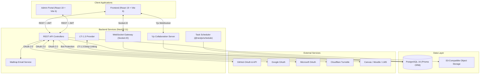

# Launchpd Classroom

**The zero-install, browser-native coding classroom for teachers and students.**

Launchpd Classroom is a full-stack educational platform that lets instructors create, distribute, and grade coding assignments entirely in the browser. Students write real code in a Monaco-powered IDE, run it in a WebContainer sandbox, and publish to a global edge network — all without installing anything locally.

---

## Table of Contents

- [Project Overview](#project-overview)
- [Architecture](#architecture)
- [Technology Stack](#technology-stack)
- [Core Features](#core-features)
  - [Browser-Based IDE](#browser-based-ide)
  - [Classroom Management](#classroom-management)
  - [Assignment & Activity System](#assignment--activity-system)
  - [Quiz System](#quiz-system)
  - [Grading Engine](#grading-engine)
  - [Project System](#project-system)
  - [Real-Time Collaboration](#real-time-collaboration)
  - [Analytics & Reporting](#analytics--reporting)
  - [Organization & Multi-Tenancy](#organization--multi-tenancy)
  - [LMS Integration (LTI 1.3)](#lms-integration-lti-13)
  - [GitHub Integration](#github-integration)
  - [Activity Library & Templates](#activity-library--templates)
  - [Notification System](#notification-system)
  - [Support Ticket System](#support-ticket-system)
  - [Import & Export](#import--export)
  - [Documentation System](#documentation-system)
  - [Time Tracking](#time-tracking)
  - [Achievements & Badges](#achievements--badges)
  - [1-Click Static Hosting](#1-click-static-hosting)
- [Authentication & Security](#authentication--security)
- [Super Admin Portal](#super-admin-portal)
- [User Roles](#user-roles)
- [Frontend Application](#frontend-application)
- [Backend API](#backend-api)

---

## Project Overview

Launchpd Classroom solves the biggest pain points in teaching web development:

- **No environment setup** — Students code in a full Node.js environment running natively in the browser via WebContainers. No OS conflicts, no "it works on my machine" excuses.
- **Instant project hosting** — Every project can be published to a live URL with one click.
- **Streamlined grading** — Teachers review student code and live previews side-by-side in a dedicated grading view.
- **Real-time visibility** — Instructors see who is actively coding, track progress, and collaborate in real time.

The platform is composed of four main applications:

| Application | Purpose |
| :--- | :--- |
| **Frontend** | Student and teacher-facing web application (React + Vite) |
| **Backend** | RESTful API server with WebSocket support (NestJS + Prisma + PostgreSQL) |
| **Admin Portal** | Super administrator console for platform-wide management (React + Vite) |
| **Preview** | Project documentation and repository overview |

---

## Architecture

---

## Technology Stack

### Frontend

| Layer | Technology |
| :--- | :--- |
| **Framework** | React 19, TypeScript |
| **Build** | Vite 6, esbuild |
| **Styling** | Tailwind CSS 4, Lucide Icons |
| **Code Editor** | Monaco Editor (@monaco-editor/react) |
| **Terminal** | xterm.js |
| **Runtime Sandbox** | WebContainer API (@webcontainer/api) |
| **State Management** | TanStack Query v5, React Context |
| **Routing** | React Router v7 |
| **Real-Time** | Socket.IO Client, Yjs + y-websocket + y-monaco |
| **Charts** | Recharts |
| **Animations** | Motion (Framer Motion) |
| **Markdown** | react-markdown, @uiw/react-md-editor |

### Backend

| Layer | Technology |
| :--- | :--- |
| **Framework** | NestJS 11, TypeScript |
| **Database** | PostgreSQL 16 via Prisma ORM 7 |
| **Authentication** | Passport.js (JWT, Local, GitHub, Google, Microsoft) |
| **WebSockets** | Socket.IO via @nestjs/websockets |
| **Collaboration** | Yjs + y-websocket |
| **File Storage** | AWS S3 SDK (@aws-sdk/client-s3) |
| **Email** | Mailtrap, Nodemailer |
| **Rate Limiting** | @nestjs/throttler (multi-tier) |
| **Scheduling** | @nestjs/schedule |
| **2FA** | otplib (TOTP) + qrcode |
| **Bot Protection** | Cloudflare Turnstile |
| **Data Export** | ExcelJS, PapaParse (CSV) |

---

## Core Features

### Browser-Based IDE

A full-featured development environment that runs entirely in the browser:

- **Monaco Editor** — The same editor engine that powers VS Code, with syntax highlighting, IntelliSense, multi-cursor editing, and theme support
- **WebContainer Runtime** — Full Node.js environment running in the browser via WebAssembly; supports `npm install`, dev servers, and build tooling without any local setup
- **Integrated Terminal** — xterm.js-powered terminal for running commands, viewing logs, and interacting with the Node.js runtime
- **Live Preview** — Real-time preview pane that renders the running application alongside the code
- **File Explorer** — Full file tree with create, rename, delete, cut/copy/paste operations for files and folders
- **Search & Replace** — Global find and replace across all project files
- **Project Download** — Export the entire project as a `.zip` archive
- **Project Upload** — Import files or templates into the workspace
- **Resizable Panels** — Drag-to-resize layout between editor, terminal, and preview panes
- **Supported Frameworks** — Vite + React, Next.js, Astro, Vue + Vite, SvelteKit, Nuxt, Vanilla HTML/CSS, Tailwind CSS

### Classroom Management

Comprehensive tools for organizing and running coding classrooms:

- **Create Classrooms** — Teachers create classrooms with name, section, room, description, custom icon, banner image, and color theme
- **Invite Codes** — Each classroom generates a unique invite code for students to join
- **Student Roster** — View all enrolled students with live status indicators (online/offline/active)
- **Classroom Hub** — Central view with tabs for General (posts & announcements), Classwork (assignments & quizzes), Students (roster & management), and Settings
- **Student Management** — Restrict student access to specific activities, force session refresh, remove students from classroom
- **Classroom Archival** — Archive classrooms with scheduled deletion support
- **Classroom Customization** — Custom icons (from a curated icon set), banner images, and color themes
- **Grading Scale Configuration** — Per-classroom grading scale (percentage, points, or letter)
- **Auto-Publish Grades** — Optional automatic grade publication to students

### Assignment & Activity System

- **Activity Types** — Three types: Assignments (coding), Quizzes, and Materials (read-only resources)
- **Assignment Creator** — Rich editor for creating assignments with Markdown instructions, learning objectives, starter template files, expected output, due dates, and time limits
- **Starter Templates** — Upload `.zip` starter code or configure starter files directly in the editor; students receive these as their initial workspace
- **Learning Objectives** — Define objectives with per-file validation rules (JavaScript, HTML, CSS, or regex-based) that auto-check student code
- **Activity Categories** — Organize activities into custom categories with icons
- **Bulk Assignment** — Assign activities to classrooms directly from the activity library
- **Due Date Management** — Set due dates with upcoming deadline tracking on the student dashboard
- **Activity Status Tracking** — Track per-student status: not started, in progress, submitted, graded, needs revision

### Quiz System

- **Quiz Manager** — Dedicated quiz builder for creating multiple-choice assessments
- **Question Editor** — Add questions with multiple options, correct answer selection, and optional explanations
- **Quiz Options** — Time limits, option shuffling, and results visibility control (immediate, after due date, or manual release)
- **Quiz Taking** — Students take quizzes within the platform with a timed interface
- **Quiz Analytics** — Detailed analytics per quiz showing per-question performance, score distributions, and class averages
- **Auto-Grading** — Quizzes are automatically graded on submission with instant score calculation

### Grading Engine

- **Grading Queue** — Centralized queue showing all pending submissions across classrooms, sortable and filterable
- **Grading View** — Side-by-side view of student source code (read-only Monaco editor) and their live deployed site
- **Inline Feedback** — Leave detailed feedback annotations on submissions
- **Grade Assignment** — Assign numerical grades with status transitions (pending → graded → needs revision)
- **Bulk Actions** — Select and process multiple submissions at once
- **LTI Grade Sync** — Automatically sync grades back to the connected LMS via LTI 1.3 Assignment and Grade Services

### Project System

- **Personal Projects** — Users create standalone coding projects outside of classrooms
- **Project Templates** — Start from pre-built templates (Vite + React, Next.js, Astro, Vue, Svelte, Nuxt, Vanilla HTML/CSS, Tailwind CSS)
- **Project Status Lifecycle** — Draft → Published → Archived → Shared
- **Star / Favorite** — Bookmark frequently accessed projects
- **Project Publishing** — Publish projects to a live public URL (`/p/:projectId`) accessible by anyone
- **Visibility Controls** — Set projects as public or restrict access to specific email addresses
- **Project Search** — Search and filter across all personal projects

### Real-Time Collaboration

- **Live Collaborative Editing** — Multiple users edit the same file simultaneously via Yjs CRDT sync (similar to Google Docs)
- **Cursor Awareness** — See collaborators' cursors and selections in real time
- **IDE Chat** — Built-in chat in the IDE for communication between collaborators (persisted via `IdeChatMessage` model)
- **Collaboration Mode** — Teachers can open a student's workspace in collaborative mode (`/edit/:projectId/collab/:classroomId/:studentId`)
- **Socket.IO Events** — Real-time notifications for classroom events, submission updates, and collaboration state changes

### Analytics & Reporting

- **Student Progress Dashboard** — Per-student progress tracking across classrooms with grade averages, completion rates, and submission history
- **Classroom Analytics** — Aggregate classroom metrics: total students, active assignments, pending submissions, at-risk students
- **At-Risk Student Detection** — Automatically flag students with low grades or missing assignments
- **Section Filtering** — Filter analytics by classroom section
- **CSV Export** — Export analytics data as CSV for external analysis
- **Contribution Tracking** — Track user contributions and coding activity over time

### Organization & Multi-Tenancy

- **Organizations** — Top-level entity representing educational institutions; supports multiple classrooms and workspaces
- **Workspaces** — Logical groupings of classrooms within an organization for departmental or course-level separation
- **Invite Codes** — Organization-level invite codes for bulk student onboarding
- **Organization Roles** — Three-tier role system: Org Admin, Teacher, Student
- **Email Invitations** — Invite members via email with pre-assigned roles
- **Member Management** — View, restrict, or remove organization members
- **Organization Settings** — Profile customization, workspace management, member administration, and invitation management

### LMS Integration (LTI 1.3)

- **LTI 1.3 Advantage** — Full LTI 1.3 integration supporting Deep Linking, Assignment and Grade Services (AGS), and Names and Roles Provisioning
- **Supported LMS Platforms** — Canvas, Moodle, Blackboard, and other LTI 1.3-compliant systems
- **Deep Linking** — Teachers can link Launchpd activities directly into their LMS course modules
- **Grade Passback** — Automatic grade synchronization from Launchpd back to the LMS gradebook
- **Resource Links** — Persistent mapping between LMS resources and Launchpd activities
- **LMS Settings Page** — Organization-level configuration for LMS integration with issuer, client ID, deployment ID, key set URL, and key pair management

### GitHub Integration

- **GitHub OAuth** — Connect GitHub account via OAuth for seamless integration
- **Sync to GitHub** — Push any Launchpd project to a new or existing GitHub repository with one click
- **Repository Visibility** — Choose public or private when syncing to GitHub
- **Import from GitHub** — Search and import repositories from connected GitHub account
- **GitHub Profile Link** — Display GitHub username on user profiles

### Activity Library & Templates

- **Activity Library** — Personal library of reusable activity templates that can be assigned to any classroom
- **Template Categories** — Organize templates into custom categories with icons
- **Template Properties** — Name, title, instructions (Markdown), objectives, starter files, difficulty level, and point values
- **Quick Deploy** — Create classroom activities directly from library templates with one click
- **Template Management** — Full CRUD operations on templates and categories

### Notification System

- **In-App Notifications** — Real-time notification dropdown with unread count badge
- **Notification Types** — Classwork assigned, submission graded, class announcements, system alerts
- **Toast Notifications** — Transient toast messages for immediate feedback
- **Action Links** — Notifications include clickable action URLs for direct navigation
- **Read/Unread State** — Track read state per notification
- **Notification Preferences** — User-configurable notification preferences in settings

### Support Ticket System

- **Ticket Creation** — Submit support tickets with categorized issue types (Account Access, Classroom Invites, IDE Issues, General Inquiry)
- **Ticket Lifecycle** — Status progression: Open → Pending → Resolved
- **Priority Levels** — Low, Medium, High priority assignment
- **Threaded Messages** — Conversation-style message thread per ticket with attachments
- **System Info Collection** — Auto-collects browser, OS, and screen resolution when submitting tickets
- **Guest Submissions** — Non-authenticated users can submit tickets with email and name
- **Internal Notes** — Admin-only internal messages within tickets
- **Turnstile Protection** — Bot protection on guest ticket submissions

### Import & Export

- **Data Import** — Import users, classrooms, and activities from CSV/Excel files
- **Data Export** — Export classroom rosters, grades, analytics, and activity data as CSV or Excel
- **Scheduled Exports** — Configure recurring automated exports delivered via email
- **GitHub Import** — Import project files from GitHub repositories
- **Template Import** — Import starter templates from `.zip` files or GitHub
- **Template Validation** — Automatic validation of imported templates for supported framework detection

### Documentation System

- **Docs Portal** — Built-in documentation center with categorized articles
- **Category Management** — Organize docs into categories with custom icons and ordering
- **Markdown Content** — Articles written in rich Markdown with full formatting support
- **Admin Authoring** — Admin users create and manage documentation articles
- **Searchable** — Full-text search across all documentation content

### Time Tracking

- **Activity Time Tracking** — Automatic time tracking for student coding sessions in the IDE
- **Per-Activity Breakdown** — Track time spent per activity, per classroom, and per project
- **Session Recording** — Record individual coding sessions with duration
- **Time Reports** — View aggregated time data for productivity insights

### Achievements & Badges

- **Badge System** — Award badges to students for milestones and accomplishments
- **Custom Badges** — Configurable badges with name, icon, color, background, border, and description
- **Achievement Page** — Dedicated page for students to view their earned badges
- **Automatic Awards** — Badge logic tied to activity completion and engagement metrics

### 1-Click Static Hosting

- **Instant Publishing** — Publish any project to a live URL (`/p/:projectId`) with one click
- **Global Access** — Published projects are accessible via shareable URLs without authentication
- **Live Preview** — Published projects render the full application in a standalone viewer
- **Visibility Controls** — Public access or restricted to specific email addresses
- **Unpublish** — Revert published projects back to draft status at any time

---

## Authentication & Security

- **Email/Password Authentication** — Standard registration and login with password validation (minimum length, uppercase, special characters)
- **OAuth 2.0 Social Sign-In** — Sign in with Google, GitHub, or Microsoft accounts
- **Two-Factor Authentication (2FA)** — TOTP-based 2FA with QR code setup via authenticator apps
- **JWT Tokens** — Access tokens with refresh token rotation for persistent sessions
- **Password Reset** — Email-based password reset flow with secure tokens
- **Password History** — Prevent password reuse by tracking historical password hashes
- **Account Lockout** — Configurable failed login attempt lockout policy
- **Rate Limiting** — Multi-tier throttling: default (120/min), short burst (30/10s), auth (60/5min), heavy operations (20/min)
- **Cloudflare Turnstile** — Bot protection on authentication and guest forms
- **Helmet Security Headers** — HTTP security headers via Helmet middleware
- **Role-Based Access Control** — Four-tier role system enforcing permissions across all API endpoints

---

## Super Admin Portal

A dedicated admin console for platform operators and super administrators:

- **Platform Overview** — System health indicators, active user counts, and platform-wide statistics
- **User Management** — Search, view, edit, disable, and delete user accounts; force password resets; manage roles
- **Organization Management** — Create, edit, and delete organizations; view organization details with classrooms, members, and workspaces
- **Platform Analytics** — Visualized charts covering user engagement, classroom activity, assignment completion rates, and system throughput (Recharts)
- **Notification Broadcasting** — Send platform-wide announcements to all users or targeted groups
- **Support Ticket Management** — View and respond to support tickets with internal notes and priority assignment
- **Database Management** — Database health monitoring and management tools
- **System Logs** — Searchable audit logs with severity levels, source tracking, IP addresses, and user attribution
- **Documentation Management** — CRUD management of public documentation articles and categories
- **Platform Settings** — Configure system-wide settings including session timeouts, concurrent session limits, password policies, and MFA enforcement
- **Auth & Security Configuration** — Manage authentication policies and security settings
- **LMS Integration Settings** — Platform-level LMS integration configuration
- **Data Import/Export** — Bulk import users and data from CSV/Excel; configure and manage scheduled exports

---

## User Roles

| Role | Scope | Key Permissions |
| :--- | :--- | :--- |
| **Super Admin** | Platform-wide | Full platform management, user administration, system configuration |
| **Admin** | Organization | Organization settings, classroom oversight, teacher management |
| **Teacher** | Classroom | Create classrooms & assignments, grade submissions, view analytics, manage students |
| **Student** | Classroom | Join classrooms, complete assignments & quizzes, submit work, view grades |

---

## Frontend Application

The main student and teacher-facing application built with React 19 and Vite 6.

### Key Pages

| Route | Page | Description |
| :--- | :--- | :--- |
| `/` | Home | Landing page with hero, feature showcase, and pricing |
| `/dashboard` | Dashboard | Personalized dashboard with classrooms, upcoming deadlines, recent activity, and quick actions |
| `/class/:id` | Classroom Hub | Classroom view with General, Classwork, Students, and Settings tabs |
| `/edit/:projectId` | IDE Zone | Full browser IDE with editor, terminal, file explorer, and live preview |
| `/assign/new` | Assignment Creator | Rich assignment builder with instructions, starter code, and objectives |
| `/quiz/manage` | Quiz Manager | Quiz creation and management interface |
| `/class/:id/quiz/:quizId/take` | Quiz Take | Student quiz-taking interface with timer |
| `/class/:id/quiz/:quizId/analytics` | Quiz Analytics | Per-quiz performance analytics |
| `/grading` | Grading Queue | Centralized submission grading queue |
| `/grading/:activityId/:studentId` | Grading View | Side-by-side code review and grading interface |
| `/projects` | Projects | Personal project management |
| `/templates` | Templates | Project template gallery |
| `/activity-library` | Activity Library | Reusable activity template library |
| `/analytics` | Analytics | Student progress and classroom analytics dashboard |
| `/settings` | Settings | User profile, notifications, security, and integrations |
| `/org-settings` | Organization Settings | Organization management (members, workspaces, invitations) |
| `/org-settings/lms` | LMS Settings | LTI 1.3 integration configuration |
| `/achievements` | Achievements | Student badge and achievement showcase |
| `/time-tracking` | Time Tracking | Coding session time reports |
| `/assignments` | Student Assignments | Student assignment overview |
| `/grades` | Student Grades | Student grade summary |
| `/support` | Support | Support ticket submission and tracking |
| `/p/:projectId` | Published Project | Live published project viewer |
| `/pricing` | Pricing | Subscription plans and pricing |
| `/docs` | Documentation | Help center and documentation |

### Key Components

- **DashboardLayout** — Sidebar navigation, organization switcher, and global search
- **CommandPalette** — Keyboard-shortcut-activated command palette for quick navigation
- **GlobalSearch** — Universal search across classrooms, activities, students, and projects
- **AuthModal** — Multi-mode authentication modal (login, signup, 2FA, OAuth, forgot/reset password)
- **CreateClassroomModal** — Classroom creation wizard with icon picker and configuration
- **CreateProjectModal** — Project creation with template selection
- **ImportModal** — Import from GitHub repositories, URLs, or file upload
- **SyncToGithubModal** — Push projects to GitHub repositories
- **PublishProjectModal** — Publish projects to live URLs with visibility controls
- **InviteMembersModal** — Invite users to organizations via email
- **GuestIde** — Unauthenticated IDE demo for the landing page
- **GetStartedChecklist** — Onboarding checklist for new users

---

## Backend API

The NestJS 11 backend provides a comprehensive REST API and WebSocket services.

### API Modules

| Module | Endpoint Prefix | Description |
| :--- | :--- | :--- |
| **Auth** | `/auth` | Registration, login, OAuth callbacks, 2FA, password reset, session management |
| **Users** | `/users` | User profile CRUD, avatar upload, contribution tracking |
| **Organizations** | `/organizations` | Organization CRUD, member management, invite codes |
| **Classrooms** | `/classrooms` | Classroom CRUD, student enrollment, roster management, archival |
| **Classroom Posts** | `/classroom-posts` | Announcement posts, comments, and emoji reactions |
| **Classroom Activities** | `/classroom-activities` | Activity CRUD, submissions, grading, quiz management |
| **Activity Categories** | `/activity-categories` | Template category management |
| **Activity Templates** | `/activity-templates` | Reusable activity template CRUD |
| **Projects** | `/projects` | Personal project CRUD, publishing, file management |
| **GitHub** | `/github` | OAuth flow, repository sync, import |
| **Collaboration** | WebSocket | Real-time collaborative editing via Yjs and Socket.IO |
| **Analytics** | `/analytics` | Student progress, classroom metrics, CSV export |
| **Notifications** | `/notifications` | Notification CRUD, read state management |
| **Support** | `/support` | Ticket CRUD, message threads, priority/status management |
| **Docs** | `/docs` | Documentation category and article CRUD |
| **Settings** | `/settings` | System settings, password policies, MFA config |
| **Imports** | `/imports` | Bulk CSV/Excel data import |
| **Exports** | `/exports` | Data export and scheduled export management |
| **LTI** | `/lti` | LTI 1.3 launch, deep linking, grade passback |
| **Uploads** | `/uploads` | File upload to S3-compatible storage |
| **Turnstile** | `/turnstile` | Cloudflare Turnstile verification |
| **Mail** | Internal | Email service for notifications, invitations, and password resets |
| **Logs** | `/logs` | System audit log querying and management |
| **Database** | `/database` | Database health and management endpoints |

### Database Schema

The PostgreSQL database is managed via Prisma ORM with 30+ models including:

- `User`, `Organization`, `OrganizationMember`, `OrganizationInvitation`
- `Workspace`, `WorkspaceTeacher`
- `Classroom`, `ClassroomStudent`
- `ClassroomPost`, `ClassroomPostComment`, `ClassroomPostCommentReaction`
- `ClassroomActivity`, `ActivitySubmission`
- `ActivityTemplateCategory`, `ActivityTemplate`
- `QuizQuestion`, `QuizOption`
- `Project`, `IdeChatMessage`
- `TimeSession`, `Badge`, `UserBadge`
- `Notification`, `SupportTicket`, `SupportTicketMessage`
- `DocCategory`, `DocArticle`
- `SystemSettings`, `SystemLog`, `PasswordHistory`
- `LmsIntegration`, `LtiResourceLink`
- `ScheduledExport`, `ImportJob`, `RefreshToken`

---

## License

This project is proprietary software. All rights reserved.
